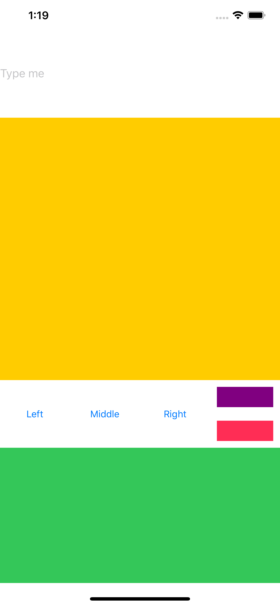

# DeclarativeUIKit

Base on [LBTATools](https://github.com/bhlvoong/LBTATools)

Thanks to Brian Voong


## Sample with declarative programming style
Put the code in `UIViewController` or `UIView` to start add all subviews in it

```swift
vstack(
    UITextField().setUp({ tf in
        tf.placeholder = "Type me"
    })
        .with(height: 130),
    UIView(backgroundColor: .systemYellow),
    hstack(
        UIButton(title: "Left", titleColor: .systemBlue, target: self, action: #selector(pressLeftBtn)),
        UIButton(title: "Middle", titleColor: .systemBlue)
            .withTap(target: self, action: #selector(pressMiddleBtn), for: .touchUpInside),
        UIButton(title: "Right", titleColor: .systemBlue, target: self, action: #selector(pressRightBtn)),
        
        vstack(
            UIView(backgroundColor: .purple),
            UIView(backgroundColor: .systemPink),
            spacing: 20,
            distribution: .fillEqually
        ).with(margins: .allSides(10)),
        
        distribution: .fillEqually
    ).with(height: 100),
    
    UIView(backgroundColor: .systemGreen)
        .withTapGesture(self, selector: #selector(tapOnBottomView))
        .with(height: 200)
)
```

And here we have: 

